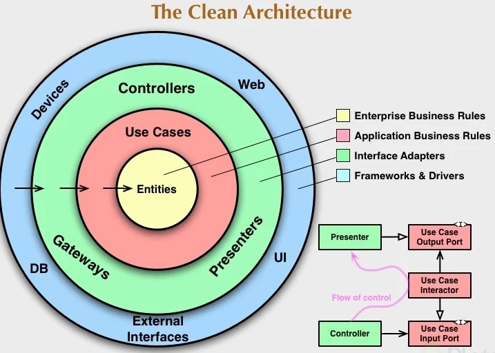

# Testing Java

##### Table of contents
* [Introduction](#introduction) 
* [Technologies](#technologies)
* [Commands](#commands)
* [Syntax](#syntax)
* [Illustrations](#illustrations)

## Introduction
We learn that exist manual and automatic tests, the automatic ones will need more development time and sometimes not be visible, but you better try to make automatic tests because:
* They are faster.
* They are more reliable.
* They are incremental.


****************************************************

## Technologies
* IntelliJ IDEA 2021.1
* Java 11

****************************************************

## Commands:
JUnit Classes

| Class Name | Functionality                    |
| ------------- | ------------------------------ |
| `Assert`      | A set of assert methods.       |
| `TestCase`   |  A test case defines the fixture to run multiple tests.    | 
| `TestResult`   | A TestResult collects the results of executing a test case.    | 
| `TestSuite`   |  	A TestSuite is a composite of tests.     | 

****************************************************

## Syntax
#### Using JUnit
```java
import org.junit.runner.JUnitCore;
import org.junit.runner.Result;
import org.junit.runner.notification.Failure;

public class TestRunner {
   public static void main(String[] args) {
      Result result = JUnitCore.runClasses(TestJunit.class);
		
      for (Failure failure : result.getFailures()) {
         System.out.println(failure.toString());
      }
		
      System.out.println(result.wasSuccessful());
   }
}  	
```

****************************************************


## Illustrations
##### The Clean Architecture


****************************************************

##### Basic Test Practice


****************************************************
